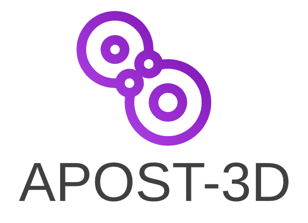

<p align="center"></p>

## Chemical concepts from wave function analysis

APOST-3D reads a converged wavefunction (a formatted checkpoint file from
Gaussian, Q-Chem, pySCF, ...) and translates it into chemical language:
atomic charges and bond orders, effective atomic and fragment orbitals,
oxidation states (EOS, GEOS, OSLO), local spins, and the decomposition of
the molecular energy into atomic and interatomic terms (IQA). It is
developed by P. Salvador (University of Girona), M. Gimferrer (University
of Göttingen) and collaborators, and builds with free, open-source tools
only (gfortran, OpenBLAS).

📖 **Documentation: https://apost3d.readthedocs.io** — installation,
a tutorial, one page per analysis method, the complete input reference,
and a [developer guide](https://apost3d.readthedocs.io/en/latest/developer/building.html)
(building, the test suite, adding tests).

## Quick start

Install gfortran (10 or newer), OpenBLAS and CMake with your package
manager (e.g. `sudo apt install gfortran libopenblas-dev cmake`), then

```bash
git clone https://github.com/mgimferrer/APOST3D.git
cd APOST3D
bash make_compile.sh      # builds everything, including libxc
make test                 # checks the build
```

and run a calculation from the folder with `jobname.fchk` and
`jobname.inp`:

```bash
ulimit -s unlimited
$APOST3D_PATH/apost3d jobname > jobname.apost 2>&1
```

with `export APOST3D_PATH=/path/to/APOST3D` in your shell profile. The
[installation page](https://apost3d.readthedocs.io/en/latest/installation.html)
covers every system (including clusters and macOS), and the
[tutorial](https://apost3d.readthedocs.io/en/latest/tutorial.html) walks
through a first calculation.

## Citing

Please cite the program paper,

* P. Salvador, E. Ramos-Cordoba, M. Montilla, L. Pujal and M. Gimferrer,
  *J. Chem. Phys.*, **2024**, 160, 172502.
  DOI: [10.1063/5.0206187](https://doi.org/10.1063/5.0206187)

and the papers of the analyses you used, listed on the
[citations page](https://apost3d.readthedocs.io/en/latest/citations.html)
(and printed at the top of every output).

## Bug reports and questions

Please open an issue on the [issues page](https://github.com/mgimferrer/APOST3D/issues),
or write to mgimferrer18@gmail.com or pedro.salvador@udg.edu.
